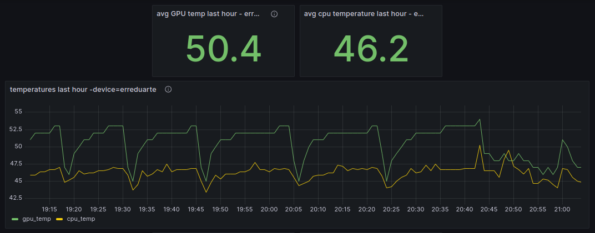

# Kafka-Based CPU/GPU Temperature Streaming

This project demonstrates a complete data streaming pipeline that reads real-time CPU and GPU temperature data streamed from remote devices.
The streaming is done by [Fernando Abreu's **telemetry-publisher**](https://github.com/nandoabreu/telemetry-publisher) repo.

The streaming data is consumed from **Apache Kafka** and processed with **Apache Spark Streaming**.
The pipeline writes the processed data to **PostgreSQL**, which is then visualized using **Grafana**
for real-time dashboard insights.

## Project Overview

### config.json

A configuration file with keys and secrets is required to access resources such as Kafka, Spark and Postgres.
The data can be set with the template [config.json](py_code/config.json).

### Data Source

The data comes from a custom streaming service that captures CPU temperature metrics from multiple devices.
These temperature readings are continuously streamed and published to a Kafka topic.

### Data Ingestion

**Apache Kafka** is used to handle the real-time ingestion of the data.
Each device streams its temperature records to Kafka topics, which **Spark Streaming** subscribes to for further processing.

### Data Processing

**Apache Spark Streaming** reads the raw temperature data from Kafka, transforms it by parsing the JSON records,
and cleans the data for further analysis. In transformation phase, device-specific fields such as CPU temperature and timestamps are extracted.

### Data Storage

After processing, the transformed data is stored into a **PostgreSQL** database for persistence.

### Visualization

In this project, **Grafana** is utilized to create a dynamic dashboard that visualizes the data, providing valuable insights into the
usage of the devices over time. The dashboard pulls data directly from PostgreSQL, enabling the generation of informative charts and graphs that
enhance readability and interpretation of the data for three devices.

To give you a glimpse of the dashboard’s layout and functionality, a snapshot link is
available [here](https://snapshots.raintank.io/dashboard/snapshot/kMfGdNWghBjyHv8xq0afocYXklkrFjbt?orgId=0&refresh=1m).
Or at the snapshot here presented.



> Note: Please note that this snapshot does not reflect live data due to privacy constraints associated with the database connection.
> However, it effectively showcases the current configuration and design of the dashboard,
> demonstrating how the CPU temperature metrics are visualized.

## Process Flow

1. **Extract**: Kafka streams CPU and GPU temperature records from the devices.
2. **Transform**: Spark Streaming processes and cleans the incoming data.
3. **Load**: The transformed data is stored in PostgreSQL.
4. **Visualize**: Grafana generates real-time visual dashboards from the stored data.

## Local install

This App handles the data flow between Kafka and Spark, between Spark and PostgreSQL,
and between PostgreSQL and Grafana. To enable and run this App, Python requirements must be installed
and connections must be set (see [config.json](#configjson) in this document).

### Requirements

- [postgresql-42.7.2.jar](https://jdbc.postgresql.org/download/postgresql-42.7.2.jar)
  - This Spark requirement must be downloaded and its path set in [config.json](config.json)

### Set-up

It is recommended to use a Python virtual environment in the local system. The following
Makefile command can set the local environment:

```shell
make env-setup
```

## Run the pipeline

To start consuming and storing data, activate the env and run the script.
The following Makefile command will make that happen:

```shell
make start-pipeline
```
